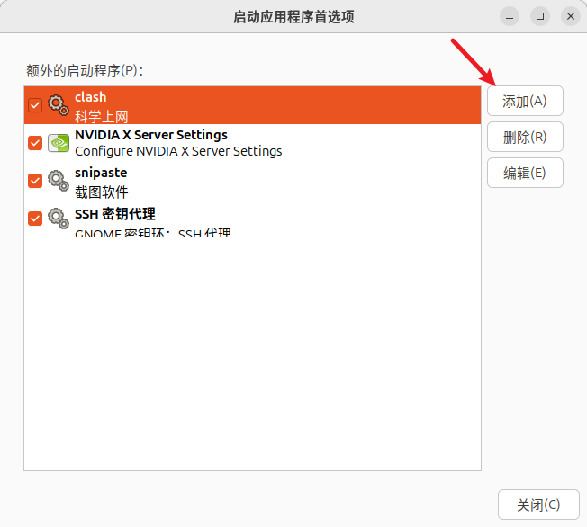
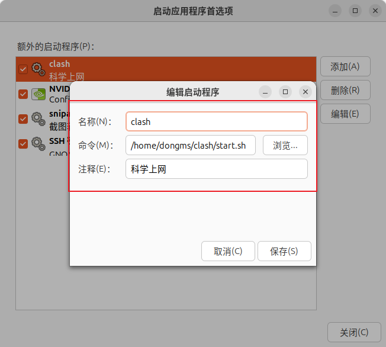

# ubuntu 

## 一、软件安装

### Clash

> 科学上网工具

```shell
cd && mkdir clash
gunzip clash*.gz
mv clash-linux-amd64-v1.18.0 clash
wget -O config.yaml "https://linkuserssnk.xxyjx.cc/s/d6BYBbiNruV0jKNU?clash=1&log-level=info"
chmod +x clash
sudo ./clash -d .
```

* 用脚本启动

  ```shell
  sudo vim start.sh
    nohup ./clash -d . > clash.log 2>&1 &
  sudo chmod +x start.sh
  ```

* 添加为开机启动

  修改start.sh脚本内容，改为全路径 如下

  ```shell
  nohup /home/dongms/clash/clash -d /home/dongms/clash > 	/home/dongms/clash/clash.log 2>&1 &
  ```

​		配置到“启动应用程序中”







### Typora

>  markdown编辑器

```shell
sudo dpkg -i typora*.deb
```

### Chrome

```shell
sudo dpkg -i google-chrome-stable_current_amd64.deb
```

### vim

```shell
sudo apt update
sudo apt install vim
vim --version

```

### Docker

* https://docs.docker.com/engine/install/ubuntu/

  * 1. Set up Docker's `apt` repository.

  ```shell
  # Add Docker's official GPG key:
  sudo apt-get update
  sudo apt-get install ca-certificates curl
  sudo install -m 0755 -d /etc/apt/keyrings
  sudo curl -fsSL https://download.docker.com/linux/ubuntu/gpg -o /etc/apt/keyrings/docker.asc
  sudo chmod a+r /etc/apt/keyrings/docker.asc
  
  # Add the repository to Apt sources:
  echo \
    "deb [arch=$(dpkg --print-architecture) signed-by=/etc/apt/keyrings/docker.asc] https://download.docker.com/linux/ubuntu \
    $(. /etc/os-release && echo "$VERSION_CODENAME") stable" | \
    sudo tee /etc/apt/sources.list.d/docker.list > /dev/null
  sudo apt-get update
  #若果以上报错，运行下面
  curl -fsSL https://download.docker.com/linux/ubuntu/gpg | sudo gpg --dearmor -o /usr/share/keyrings/docker-archive-keyring.gpg
  echo "deb [arch=$(dpkg --print-architecture) signed-by=/usr/share/keyrings/docker-archive-keyring.gpg] https://download.docker.com/linux/ubuntu $(lsb_release -cs) stable" | sudo tee /etc/apt/sources.list.d/docker.list
  sudo apt update
  ```

  * 2. Install the Docker packages.

  ```shell
  sudo apt-get install docker-ce docker-ce-cli containerd.io docker-buildx-plugin docker-compose-plugin
  ```

  * 3. Verify that the installation is successful by running the `hello-world` image:

    ```shell
    sudo docker run hello-world
    ```

 * 代理设置

   * 制定目录创建.conf文件

   ```shell
   sudo mkdir -p /etc/systemd/system/docker.service.d
   sudo touch /etc/systemd/system/docker.service.d/proxy.conf
   ```

   * proxy.conf文件内容

   ```shell
   [Service]
   Environment="HTTP_PROXY=http://127.0.0.1:7890/"
   Environment="HTTPS_PROXY=http://127.0.0.1:7890/"
   Environment="NO_PROXY=localhost,127.0.0.1,.example.com"
   ```

   * 重启

   ```shell
   sudo systemctl daemon-reload
   sudo systemctl restart docker
   ```

* docker-compose 

  * 1. To download and install the Docker Compose CLI plugin, run:

  ```shell
  mkdir -p /usr/local/lib/docker/cli-plugins
  sudo curl -SL https://github.com/docker/compose/releases/download/v2.30.3/docker-compose-linux-x86_64 -o /usr/local/lib/docker/cli-plugins/docker-compose
  ```

  * 2. Apply executable permissions to the binary:

  ```shell
  sudo chmod +x /usr/local/lib/docker/cli-plugins/docker-compose
  ```

  * 3. check

  ```shell
  sudo docker compose version
  ```

  

### Git

> 版本控制工具

* 1. 添加Git官方仓库

     ```shell
     sudo add-apt-repository ppa:git-core/ppa
     ```

* 2. 安装Git

     ```shell
     sudo apt update
     sudo apt install git
     git --version
     ```

* 用法

  * clone

    ```shell
    git clone https://github.com/BrightSt/note.git
    ```


### Snipaste

> 截图软件   
>
> 安装参考 ： https://blog.csdn.net/qq_44684757/article/details/136062578

```shell
1.下载
https://www.snipaste.com/download.html
2.添加可执行权限
sudo chmod +x Snipaste-2.10.3-x86_64.AppImage
3.执行
./Snipaste-2.10.3-x86_64.AppImage
```

* 启动后报错

  > dlopen(): error loading libfuse.so.2
  >
  > AppImages require FUSE to run. 
  > You might still be able to extract the contents of this AppImage 
  > if you run it with the --appimage-extract option. 
  > See https://github.com/AppImage/AppImageKit/wiki/FUSE 
  > for more information

  ```shell
  # 处理方式
  sudo add-apt-repository universe
  sudo apt update -y && sudo apt upgrade -y
  sudo apt install libfuse2 -y
  
  ！！！执行后如果不生效需要重启
  ```
  


## 二、系统设置

### 禁用snap自动更新

为什么禁用？

​	snap会自动更新，可能会导致某些软件不兼容

```shell
禁用
snap refresh --hold
开启
snap refresh --unhold
```


### 禁用系统自动更新


### sudo时无法使用代理

> sudo在切换成root用户的时候，env并不会去保留这些环境变量，需要特别的指明才可以。

```shell
# 在/etc/sudoers中，env_reset下添加
Defaults env_keep="http_proxy https_proxy ftp_proxy no_proxy"
```

### 设置静态IP

sudo vim /etc/network/interfaces

```

```

### 允许root ssh

```
vim /etc/ssh/sshd_config
PermitRootLogin yes
systemctl restart ssh
```

### 给root设置密码

```shell
sudo passwd root
```

### 配置代理

```shell
# 配置系统代理
vim ~/.bashrc
export http_proxy="http://192.168.127.1:17890"
export https_proxy="http://192.168.127.1:17890"
export ftp_proxy="http://192.168.127.1:17890"
export no_proxy="localhost,127.0.0.1,192.168.1.0/24"
source ~/.bashrc

# 配置apt代理
sudo vim /etc/apt/apt.conf.d/95proxies
Acquire::http::Proxy "http://192.168.127.1:17890";
Acquire::https::Proxy "http://192.168.127.1:17890";
```